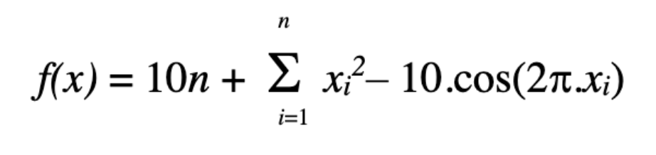
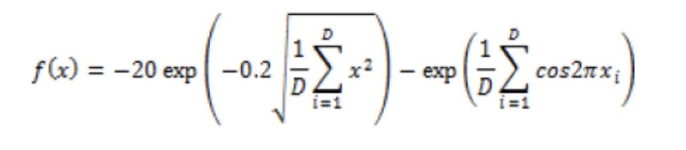
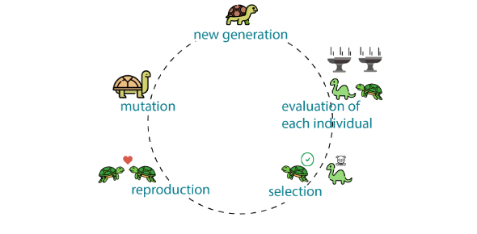

# Biocomputation

## Summary 
Nature inspired algorithms were used to optimise benchmark functions 1 and 2.

Function 1            |  Function 2
:-------------------------:|:-------------------------:
  |  

This project experiements with genetic algorithm operators solves for N and D both at size 100.

## What are genetic algorithms?

Genetic algorithms are a class of evolutionary algorithm that represent problem spaces as a population. Through the use of mathemtical operators select, crossover and mutate they solve problems in faster time then traditional search methods.

## How does this project use genetic algorithms?

This project uses genetic algorithms to optimise functions 1 and 2. Optimisation is an important part of data science and genetic algorithms are good at optimising of functions for problems involved in operation management, multimedia and wireless networking.

## What is the experimentation process?
To solve for N and D at size 100 experiements are carried out at size 10 for both functions. The experiements investigate the effect the genetic algorithm operators have on these functions at size 10 to scale up to size 100.

| 1 | 2 | 3 | 4 | 5 | 6 |
| ------------- | ------------- | ------------- | ------------- | ------------- | ------------- |
| Content Cell  | Content Cell  | Content Cell  | Content Cell  | Content Cell  | Content Cell  |

## The results 

## Conclusion

